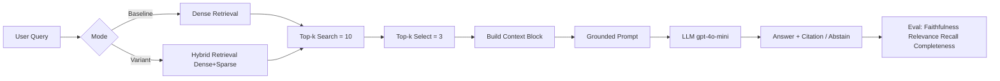

# Architecture — RAG Pipeline (Day 08 Lab)

## 1. Tổng quan kiến trúc

```
[Raw Docs]
    ↓
[index.py: Preprocess → Chunk → Embed → Store]
    ↓
[ChromaDB Vector Store]
    ↓
[rag_answer.py: Query → Retrieve → Rerank → Generate]
    ↓
[Grounded Answer + Citation]
```

**Mô tả ngắn gọn:**
Nhóm xây dựng trợ lý AI nội bộ cho CS + IT Helpdesk để trả lời câu hỏi về SLA, hoàn tiền, quyền truy cập và HR policy dựa trên tài liệu nội bộ.  
Pipeline tập trung vào grounded answer: chỉ trả lời từ context đã retrieve, có citation nguồn, và ưu tiên abstain nếu không đủ dữ liệu.  
Kiến trúc được chia theo 4 sprint: Sprint 1 (index), Sprint 2 (baseline dense retrieval + generation), Sprint 3 (variant hybrid retrieval), Sprint 4 (evaluation A/B).

---

## 2. Indexing Pipeline (Sprint 1)

### Tài liệu được index
| File | Nguồn | Department | Số chunk |
|------|-------|-----------|---------|
| `policy_refund_v4.txt` | policy/refund-v4.pdf | CS | 6 |
| `sla_p1_2026.txt` | support/sla-p1-2026.pdf | IT | 5 |
| `access_control_sop.txt` | it/access-control-sop.md | IT Security | 7 |
| `it_helpdesk_faq.txt` | support/helpdesk-faq.md | IT | 6 |
| `hr_leave_policy.txt` | hr/leave-policy-2026.pdf | HR | 5 |

**Tổng chunk trong ChromaDB:** 29

### Quyết định chunking
| Tham số | Giá trị | Lý do |
|---------|---------|-------|
| Chunk size | 400 tokens (ước lượng 1600 chars) | Cân bằng giữa đủ ngữ cảnh và tránh prompt quá dài |
| Overlap | 80 tokens (ước lượng 320 chars) | Giảm mất thông tin ở ranh giới chunk |
| Chunking strategy | Heading-based (`=== ... ===`) + size split | Giữ semantic theo section, sau đó cắt theo kích thước an toàn |
| Metadata fields | source, section, effective_date, department, access | Phục vụ filter, freshness, citation |

### Embedding model
- **Model**: OpenAI `text-embedding-3-small`
- **Vector store**: ChromaDB (PersistentClient)
- **Similarity metric**: Cosine

---

## 3. Retrieval Pipeline (Sprint 2 + 3)

### Baseline (Sprint 2)
| Tham số | Giá trị |
|---------|---------|
| Strategy | Dense (embedding similarity) |
| Top-k search | 10 |
| Top-k select | 3 |
| Rerank | Không |

### Variant (Sprint 3)
| Tham số | Giá trị | Thay đổi so với baseline |
|---------|---------|------------------------|
| Strategy | Hybrid (Dense + Sparse keyword overlap fusion) | Đổi retrieval từ dense-only sang hybrid |
| Top-k search | 10 | Giữ nguyên để so sánh công bằng |
| Top-k select | 3 | Giữ nguyên để chỉ đổi một biến retrieval |
| Rerank | Không | Giữ nguyên baseline (không thêm biến thứ 2) |
| Query transform | Không | Chưa bật trong variant chính thức |

**Lý do chọn variant này:**
Chọn Hybrid vì corpus có cả ngôn ngữ tự nhiên (policy/HR) và keyword đặc thù (SLA P1, Level 3, ERR-403).  
Dense retrieval giữ semantic match tốt, trong khi sparse retrieval giúp bám tên riêng/keyword chính xác; fusion giúp giảm miss trong các câu alias hoặc multi-detail.  
Để đúng A/B rule của lab, nhóm chỉ thay retrieval strategy (dense -> hybrid), giữ nguyên generation và các tham số top-k.

---

## 4. Generation (Sprint 2)

### Grounded Prompt Template
```
Answer only from the retrieved context below.
If the context is insufficient, say you do not know.
Cite the source field when possible.
Keep your answer short, clear, and factual.

Question: {query}

Context:
[1] {source} | {section} | score={score}
{chunk_text}

[2] ...

Answer:
```

### LLM Configuration
| Tham số | Giá trị |
|---------|---------|
| Model | `gpt-4o-mini` |
| Temperature | 0 (để output ổn định cho eval) |
| Max tokens | 512 |

---

## 5. Failure Mode Checklist

> Dùng khi debug — kiểm tra lần lượt: index → retrieval → generation

| Failure Mode | Triệu chứng | Cách kiểm tra |
|-------------|-------------|---------------|
| Index lỗi | Retrieve về docs cũ / sai version | `inspect_metadata_coverage()` trong index.py |
| Chunking tệ | Chunk cắt giữa điều khoản | `list_chunks()` và đọc text preview |
| Retrieval lỗi | Không tìm được expected source | `score_context_recall()` trong eval.py |
| Generation lỗi | Answer không grounded / bịa | `score_faithfulness()` trong eval.py |
| Token overload | Context quá dài → lost in the middle | Kiểm tra độ dài context_block |

---

## 6. Diagram (tùy chọn)


